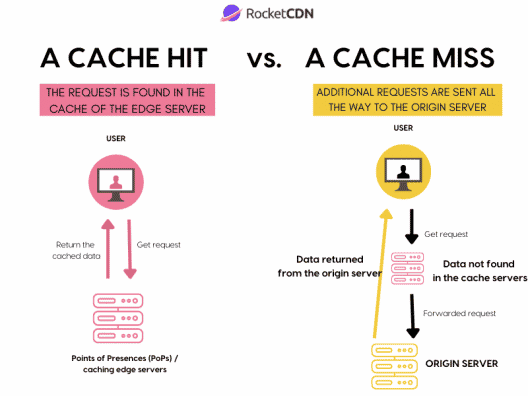
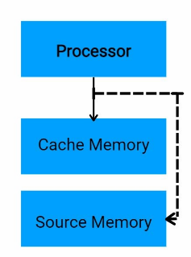
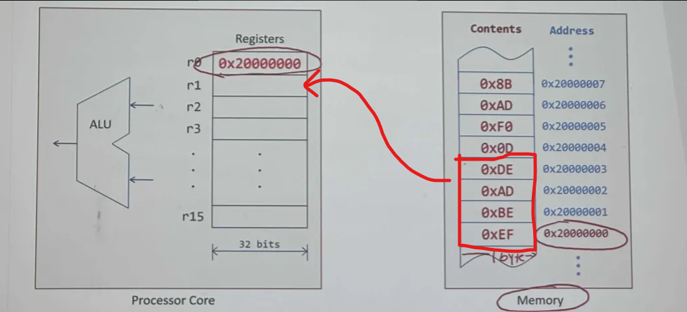
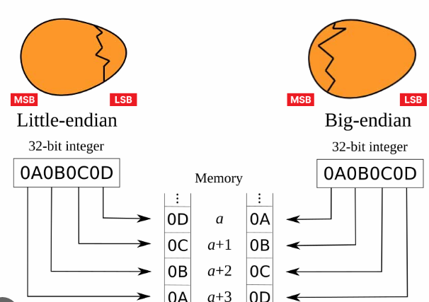
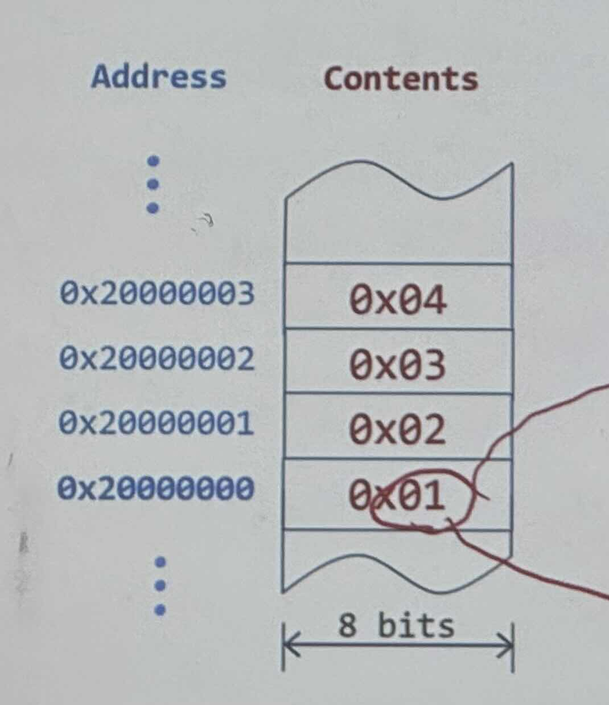
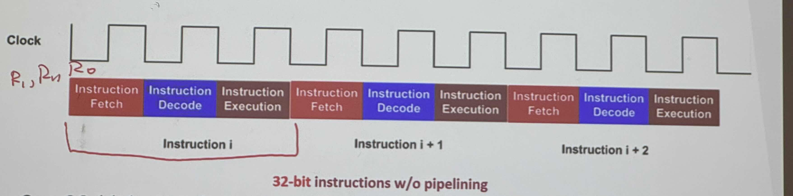
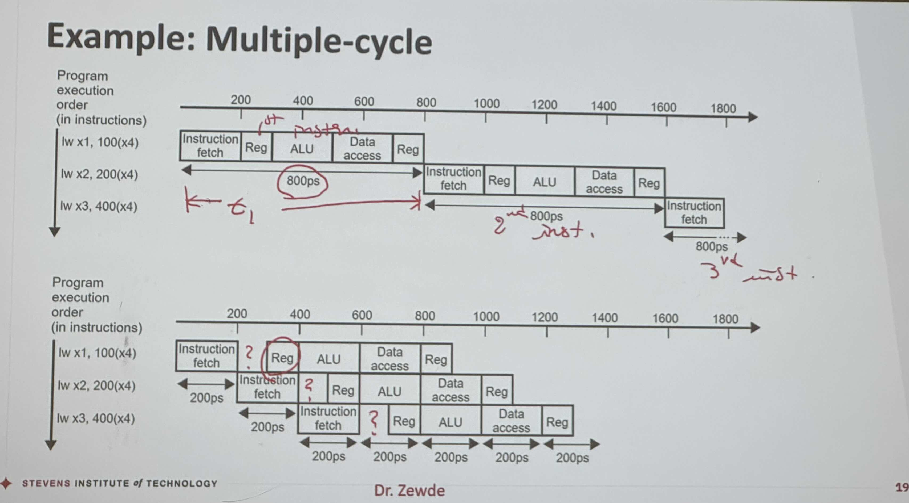

# Lecture 10.3.24

## Cache Misses

- If requested data is not found in cache, it is called **cache miss**
  - Causes **pipeline stall** in the processor



Steps taking to handle a cache miss:

1. Instruct main memory to read the location in main memory, wait for access to complete
2. Write data to the cache and set the tag and valid fields
3. Restart the operation that was originally stalled

## Cache Writes --> [Cache Writing Wiki](https://en.wikipedia.org/wiki/Cache_placement_policies)



- If we write data to a cache, it must get written to main memory at **some** point
- If data in the cache & data in main memory are different, the cache & main mem. are said to be **inconsistent**

- Simplest way to handle this is a **write-through** ie. for every cache write, immediately write to main memory
  - Write-through is not optimal, as write to main memory are more time consuming than to just the cache

## Set-associative cache

- In a **set-associative** cache, there are a **fixed number** of possible locations for a block to be placed in cache
  - If cache data is associated with row 3 in memory, then it can only be written there
  - If another row in main memory is associated with a cache location, it will be overwritten
  - Vice versa, a memory address can be associated with multiple locations in the cache
  - Issue: Now we have to search for the data, since it can be in multiple locations (search time increase)
  
- Increasing the degree of associativity usually decreases cache-miss rate
  - Since more data present in cache
  - Increases hit time (time it takes to finish data caching to CPU) since more locations must be searched
- A cache with **N possible locations** for a block is called **N-way set-association**
  - Contains a # of sets, with N blocks per set

## Fully-Associative Cache

- A **fully-associative** cache permits data to be stored in any cache block, instead of forcing each memory address into 1 particular block
  - When data fetched from memory, it can be placed in any unused block of cache
  - No memory conflicts w/ 2+ memory addresses that map to a single cache block
- Must search all cache locations, only practical for caches w/ small # of blocks


## Logic View of Memory

- By grouping bits we can store more values
  - 8 bits = 1 byte (1 slot in memory)
  - 16 bits = 2 bytes = 1 halfword
  - 32 bits = 4 bytes = 1 word
  
- 

- From software perspective, memory is an addresssable array of bytes
  - Byte 0x20000004 is 0b10000100
  - Words at 0x20000000 0x20000004

- A word can not be stored just anywhere, can only be stored in address that is divisible by 4 (word-address % 4 = 0)
- word: % 4 = 0
- halfword: % 2 = 0

## Loading Word from Memory



```ARM
LDR r1, [r0] ; r1 = memory.word[r0]
```

### Endianness (egg shape!)



- Little Endian: LSB in lowest address
- Big Endian: MSB in lowest address

**ex:**


Word stored at 0x20000000?

Little Endian: 0x04030201
Big Endian: 0x01020304

## Program Execution

- **Program Counter (PC)** is a register that holds the memory address of the next instruction to be fetched from the memory

1. Fetch instructon at PC address
2. Decode instruction
3. Execute instruction

**ex:** Fetch instruction 0x080001B0 (points to value 188B) --> execute instruction 188B

- **Fetch** the instruction from memory at location pointed to by PC register
- **Read one or two registers** (as specified by instruction)
- Use **arithmetic-logic unit (ALU)**: action depends on instruction type
  - Memory ref. instruction: ALU calculates address
  - Arithmetic/logical instruction: ALU executes operation
  - Conditional branches: ALU performs a comparison to 0
- **Final Operation**: action depends on instruction type
  - Memory ref. instruction: read or write data in memory
  - Arithmetic/logical instruction: store result in register
  - Conditional branchP update program counter as needed

### Three-state pipeline: Fetch, Decod, Execution



- **Pipleining** is a technique where multiple instructions are overlapped during execution, and it allows hardware resources to be fully utilized
- In a single-cycle implementation, every instruction i executed in 1 processor cycle

- The **clock cycle** must be same for every instruction
  - Determine dby **longest data path delay**
  - Causes shorter instructions to take same amount of time as longest

- **Multi-cycle** CPUs improve performance through pipelining which allows hardware resources to be utilized
- To increase the throughput of system, instructions can be executed by otherlapping fetch, decode, & execute phases of an instruction cycle
- Instruction pipeline reads instruction from memory while previous instructions are being execute in other segments of the pipeline



- ? indicate offset to reset onto clock cycle
- 3x800ps = 2400ps vs 7x200ps = 1400ps --> WOW!

- What if we add 1,000,000 instructions to previous 3 instructions?
  - Non-pipelined total time: 2400 + (10^6 * 800) 800,002,400 ps
  - Pipelined total time: 1400 + 200(1,000,000) = 200,001,400 ps
  - Pipelining results in improve **instruction throughput** for large # of instructions

- Time between instructions (pipeline) = (time between nonpipelined instruction) / # of pipe stages

# IMPORTANT

- DOWNLOAD ARM - KEI uVisionMDK to run assembly
- DOWNLOAD CPU-LATOR
