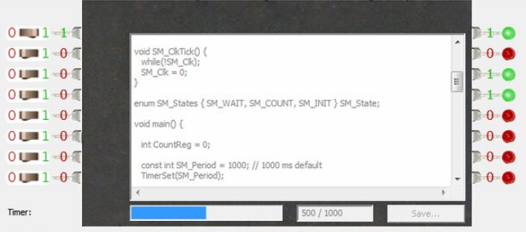

# Lecture 9.12.24

## Moore's Law

- ICs double in transistor capacity every 18 months
- 2^n quantity

## Embedded System Software & Hardware

- Software & hardware components
- Software written specifically for certain hardware on device to meet specified goal

### Software Components

- Can consist of editor, compiler, emulator, debugger

- Editor: Code written in language (C/C++/ASM) saved to text file in the editor
- Compiler: Used to turn code into low-level machine language for hardware to comprehend (key for developing executable)
- Emulator: Main task is to make embedded system act like a real system in a simulated environment
- Debugger: Used for testing & debugging purpose

### Hardware Components

- **Power Supply**: Normally a 5V PSU is required for a system (or 1.8 - 3.3V PSU)
  - Certain PSUs preferred over others (ex. battery decays over time, constant power output desired)
- **Micro Controller**: Provides computing power for system, performs calculations & processes
  - Microcontroller: Commonly 8 or 16 bits, < 300MHz, usually single core, low power consumption, no MMU, on-chip storage
  - Microprocessor: 32 or 64 bits, speeds in 100s of MHz or GHz, multi-core, high power consumption, possible MMU, external storage
- **Memory**: Essential to store data, integrated into microcontroller/processor
  - Read-Only Memory: Stores program code, non-volatile
  - Random Access Memory: Data memory, volatile
- **Timer/Counter**: Creates a delay before a specific function (timer), counts # of times an event occurs (counter)
  - Watchdog timer watches clocks over each program
- **Communication Port**: Establishes communications with other systems (UART, USB, I2C, SPI)
- **I/O Port**: Fixed # of input/outputs for connecting to other systems/sensors/etc

## Embedded Processors

- Riverside-Irvine Microcontroller (RIM): Abstraction of a microcontroller that is able to execute C code and can access A0, A1 ... A7 and B0, B1 ... B7



- Switches are examples of sensors to convert physical data into digital inputs
- LEDs simulate actuators

- C code writes relational expression between inputs & outputs 

ex. 1.3.3

A car has a sensor connected to A5 and its state changes when the car is on. Another sensor is connected to A7 determines whether a person sits on the driver seat, and a sensor connected to A1 checks if the seat belt is fastened. Write RIM C code for a "fasten seat belt" system that illuminates a warning light by making B4 = 1 when the car is on, a driver is seated, and the seat belt is not fastened. The output is displayed in B4.

A5 = car state
A7 = drivers seat
A1 = seat belt
B4 = warning light

```C
int main() {
   while(1) {
      B4 = A5 && A7 && !A1;
   }
   return 0;
}
```
