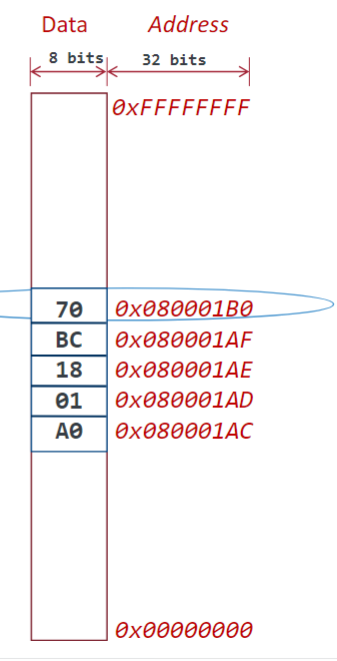

# Lecture 9.19.24

## ARM Processor (Acorn RISC Machine)

- **Instructions** and **instruction set** architecture describe instructions that are supported by processor hardware
  - CISC and RISC (Complex & Reduced Instruction Set)

### CISC

- Complex operations
- Execute in multiple clock cycles
- Work directly with memory (RAM & Read-Only)
- Built into hardware
- **Focus is on increasing performance my reducing number of instructions**

### RISC

- Instructions perform individual operations
- Fewer clock cycles to execute
- Work with values loaded into registers (low-level)
- Built into software
- **Focus is on increasing performanceby increasing rate at which instructions execute**

------------------------------------------

- ARM processors execute millions more instructions/secon than Intel
  - More efficient multicore processing
- 32-bit RISC processor widely used for embedded design
- Comes in A(pplication), R(eal-time), and M(icro-contrller) cortex

## Processor Architecture

### Von-Neumann & Harvard Architecture

### Harvard Architecture

- **Separate** data and instruction busses
  - Transfer can occur at the same time
- Faster processing speed
- Single cycle to execute instruction
- Lower power consumption rate
- Stores instructions & data in separate memories

### Von-Neumann

- **Single bus** for instructions & data
  - Allows code to be modified in-place
- Inexpensive and simple
- Data bus can bottleneck
  - Single a single bus is used, processing rate negatively impacted
  - Two clock cycles to execute one instruction
  - Allows one memory access at a time
- Stores instructions & data in same memory

## Memory

- Memory is used to perform functions by storing data/instructions for the device to work
- Separated into **volatile** & **non-volatile** (doesn't persists after poweroff and does)

- Arranged in series of locations (addresss)
- Number of locations limited, ex. 4GB of RAM 
- Values stored in address can represent program data or instruction

### Flash Memory

- **NAND** and **NOR** memory (named after logic gate to construct)
- NOR faster random reads
- NOR write and erase speads slower
- NAND greater capacity
- NOR more expensive

### EEPROM

- Electrically Erasable Programmable Read-Only Memory
- Slower than flash
- Reprogrammed by software
- Cheaper
- Small (100s of bits to few MBits)
- Useful for nonvolatile

### SRAM

- Static RAM
- Stores info. as long as power is supplied
- Transistors used to store information
- Faster than DRAM, but more expensive
- Lower bit density

### Dynamic RAM

- Stores info. as long as power is supplied (within a few ms, due to capacitor decay tine)
- Uses capacitors to store data & info. for longer time
- Need to be refreshed periodically since excess charge will still be decaying in capacitor
- Slower than SRAM
- Inexpensive & density (GB)
- Require DRAM controller to access

### Memory Hierarchy

- Based on idea of locality
  - **Temporal Locality**: If an item is referenced, it will likely be referenced again soon
  - **Spatial Locality**: If an item is referenced, other addresses that are nearby will likely be referenced
- Consists of multiple levels w/ different speeds & spizes
- Goal is to provide as much storage with fastest access times

### CPU Registers

- **Registers** are temp. high-speed storage locations built into processor
- CPUs use registers to keep values that are accessed locally to processor
  - Avoids having to fetch from memory & utilize unecessary bussses
-  Compilers responsible for assigning values to registers
  
- For ARM:
  - R0-7 used for any instruction, R8-12 used by some high-level instruction
  - R13: stack pointer, used to store address referencing any value 
  - R14: link register
  - R15: program register

### Loading Data from Memory

- Registers exist between memory and ALU (data must pass through registers to go to/from ALU)
- 